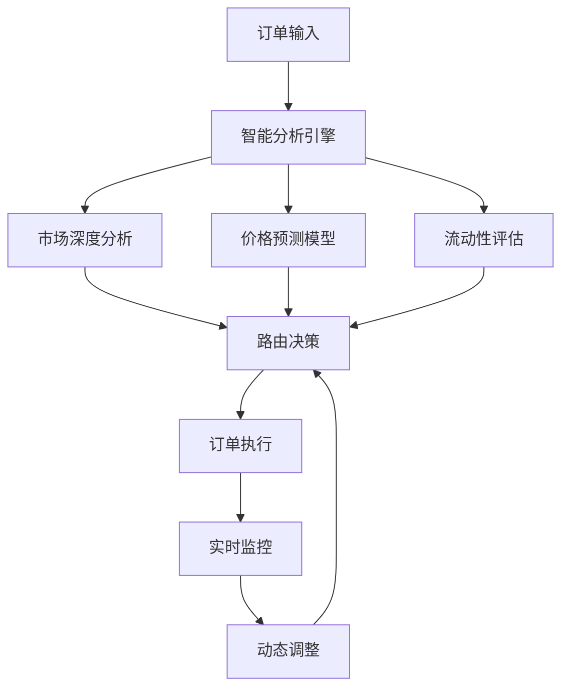

## 什么是磨损率？

磨损率（Wear Rate）是衡量交易执行质量的核心指标，反映了实际成交价格与理论最优价格之间的偏差。在高频交易和量化交易中，磨损率直接影响最终收益。

<Note>
  **磨损率公式**  
  磨损率 = (实际执行价格 - 理论最优价格) / 理论最优价格 × 100%
</Note>

## 磨损率的组成

磨损率由多个因素共同影响：

<CardGroup cols={2}>
  <Card title="市场滑点" icon="chart-line">
    **占比：40-50%**
    
    订单执行期间的价格变动
  </Card>
  <Card title="交易手续费" icon="receipt">
    **占比：20-30%**
    
    交易所收取的手续费
  </Card>
  <Card title="价差成本" icon="arrows-left-right">
    **占比：15-20%**
    
    买卖价差造成的成本
  </Card>
  <Card title="延迟损耗" icon="clock">
    **占比：10-15%**
    
    执行延迟导致的价格偏差
  </Card>
</CardGroup>

## AlphaLabs 的优势

### 行业对比

| 产品/平台 | 平均磨损率 | 优化技术 |
|-----------|------------|----------|
| **AlphaLabs EdgeX-V** | 0.0032% | 智能路由 + AI预测 |
| **AlphaLabs Lighter** | 0.0018% | 双策略协同 |
| 行业平均 | 0.05-0.1% | 基础算法 |
| 传统手动交易 | 0.1-0.3% | 无优化 |

### 技术创新

<Tabs>
  <Tab title="智能路由">
    **动态路径选择**
    - 实时分析多个交易所深度
    - 自动选择最优执行路径
    - 智能订单拆分
    
    **效果**：降低 30% 滑点
  </Tab>
  <Tab title="预测算法">
    **AI 价格预测**
    - 毫秒级市场趋势预测
    - 提前布局减少追价
    - 动态调整执行策略
    
    **效果**：降低 25% 延迟损耗
  </Tab>
  <Tab title="订单优化">
    **智能订单管理**
    - 冰山订单自动拆分
    - 时间加权平均执行
    - 避免大单冲击市场
    
    **效果**：降低 20% 市场冲击
  </Tab>
</Tabs>

## 实际案例分析

### 案例 1：高频套利交易

<Info>
  **场景**：BTC/USDT 三角套利  
  **交易量**：每日 1000 笔  
  **单笔金额**：$10,000
</Info>

**传统方式**：
- 平均磨损率：0.08%
- 日磨损成本：$800
- 月磨损成本：$24,000

**使用 AlphaLabs**：
- 平均磨损率：0.0032%
- 日磨损成本：$32
- 月磨损成本：$960
- **节省成本：$23,040/月**

### 案例 2：网格交易策略

<Info>
  **场景**：ETH/USDT 网格交易  
  **交易量**：每日 500 笔  
  **单笔金额**：$5,000
</Info>

**成本对比图表**：

```
月度磨损成本对比
├── 传统交易：$6,000
├── 行业平均：$3,750
├── EdgeX-V：$240
└── Lighter：$135
```

## 磨损率计算器

使用我们的 [磨损率计算器](/tools/wear-calculator) 来估算您的交易成本：

<Steps>
  <Step title="输入交易参数">
    - 交易对
    - 日均交易量
    - 平均订单金额
  </Step>
  <Step title="选择交易方式">
    - 手动交易
    - 使用 AlphaLabs
    - 其他自动化工具
  </Step>
  <Step title="查看对比结果">
    - 预计磨损成本
    - 潜在节省金额
    - ROI 分析
  </Step>
</Steps>

## 优化建议

### 降低磨损率的最佳实践

<AccordionGroup>
  <Accordion title="1. 选择合适的交易时段">
    - 避免在流动性低的时段交易
    - 关注主要市场开盘时间
    - 利用 AlphaLabs 的智能时机选择
  </Accordion>
  <Accordion title="2. 合理设置订单参数">
    - 使用限价单而非市价单
    - 设置合理的滑点容忍度
    - 启用智能订单拆分
  </Accordion>
  <Accordion title="3. 优化策略配置">
    - 根据市场情况调整策略
    - 使用 AlphaLabs 的自适应算法
    - 定期回测和优化
  </Accordion>
  <Accordion title="4. 监控和分析">
    - 实时监控磨损率变化
    - 分析历史数据找出模式
    - 及时调整执行策略
  </Accordion>
</AccordionGroup>

## 磨损率监控

AlphaLabs 提供实时磨损率监控仪表板：

<Warning>
  磨损率异常时会自动触发告警：
  - 黄色警告：超过平均值 50%
  - 红色警告：超过平均值 100%
  - 自动暂停：超过设定阈值
</Warning>

### 监控指标

| 指标 | 说明 | 告警阈值 |
|------|------|----------|
| 实时磨损率 | 最近 10 笔交易平均 | > 0.005% |
| 小时磨损率 | 过去 1 小时平均 | > 0.004% |
| 日磨损率 | 过去 24 小时平均 | > 0.0035% |
| 累计损耗 | 总磨损成本 | 自定义 |

## 技术原理

### AlphaLabs 磨损优化技术栈



## 收益影响

### 磨损率对年化收益的影响

假设基础策略年化收益 30%：

| 磨损率 | 实际年化收益 | 收益损失 |
|--------|-------------|----------|
| 0.0018% (Lighter) | 29.35% | 2.17% |
| 0.0032% (EdgeX) | 28.84% | 3.87% |
| 0.05% (行业平均) | 22.50% | 25% |
| 0.1% (手动交易) | 15% | 50% |

<Note>
  使用 AlphaLabs 可以保留 95% 以上的策略收益，而传统方式可能损失超过 50% 的收益。
</Note>

## 相关资源

<CardGroup cols={2}>
  <Card title="磨损计算器" icon="calculator" href="/tools/wear-calculator">
    精确计算您的交易磨损
  </Card>
  <Card title="策略优化" icon="chart-mixed" href="/concepts/trading-strategy">
    了解如何优化交易策略
  </Card>
  <Card title="风险管理" icon="shield-halved" href="/concepts/risk-management">
    学习风险控制技巧
  </Card>
  <Card title="API 文档" icon="code" href="/api-reference/introduction">
    集成磨损监控 API
  </Card>
</CardGroup>